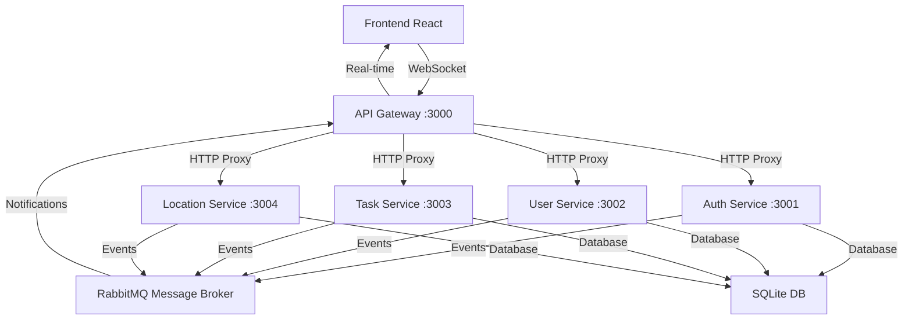

# UbicaMe V1 - Sistema Distribuido de Gestión de Flotas de Transporte

Sistema distribuido de gestión de flotas de transporte en tiempo real con arquitectura de microservicios, message broker y comunicación asíncrona desarrollado para proyecto académico.

## 🏗️ Arquitectura Distribuida

### 🎯 Funcionalidades Implementadas
- ✅ **Event-Driven Architecture** (RabbitMQ)
- ✅ **WebSockets** para tiempo real
- ✅ **Microservicios** independientes y escalables
- ✅ **API Gateway** centralizado
- ✅ **Message Broker** para comunicación asíncrona
- ✅ **Notificaciones** push en tiempo real
- ✅ **Cross-service** communication

## 🚀 Tecnologías Utilizadas

### Backend Distribuido
- **API Gateway**: Express + Socket.IO + HTTP Proxy
- **Microservicios**: Node.js + Express independientes
- **Message Broker**: RabbitMQ para eventos asíncronos
- **Base de datos**: SQLite compartida
- **WebSockets**: Socket.IO para tiempo real
- **Event Bus**: Sistema de eventos personalizado

### Frontend Reactivo
- **Frontend**: React + Socket.IO Client
- **Notificaciones**: React-Toastify
- **Estado en tiempo real**: WebSocket Context
- **Mapas**: OpenStreetMap con Leaflet

## 📁 Arquitectura del Sistema

```
UbicaMe V1/
├── api-gateway/              # API Gateway + WebSockets (Puerto 3000)
│   ├── server.js            # Proxy y WebSocket server
│   ├── eventBus.js          # Sistema de eventos RabbitMQ
│   └── websocketManager.js  # Gestor de WebSockets
├── services/                # Microservicios independientes
│   ├── auth-service/        # Servicio de autenticación (Puerto 3001)
│   ├── user-service/        # Servicio de usuarios (Puerto 3002)
│   ├── task-service/        # Servicio de tareas (Puerto 3003)
│   └── location-service/    # Servicio de ubicaciones (Puerto 3004)
├── backend/                 # Backend compartido (base de datos)
│   ├── config/             # Configuración de base de datos
│   ├── routes/             # Rutas con eventos
│   └── middleware/         # Autenticación y seguridad
├── frontend/               # Frontend React (Puerto 4000)
│   ├── src/context/        # WebSocket y Auth contexts
│   └── src/components/     # Componentes reactivos
├── install-rabbitmq.ps1   # Instalador automático de RabbitMQ
├── start-distributed-system.ps1  # Iniciador del sistema completo
└── stop-system.ps1        # Detenedor del sistema
```

## 🔄 Flujo de Eventos Distribuidos



## 🚀 Instalación y Configuración

### 1. Instalar RabbitMQ (Ejecutar como Administrador)
```powershell
# Instalación automática de RabbitMQ
.\install-rabbitmq.ps1
```

### 2. Instalar dependencias del proyecto
```bash
npm install
npm run install-all
```

### 3. Ejecutar el sistema distribuido completo
```powershell
# Inicia todos los microservicios, API Gateway y Frontend
.\start-distributed-system.ps1

# O manualmente para desarrollo
npm run dev
```

### 4. Detener el sistema
```powershell
# Detiene todos los servicios
.\stop-system.ps1
```

## 🌐 URLs del Sistema Distribuido

### Servicios Principales
- **Frontend React**: http://localhost:4000
- **API Gateway**: http://localhost:3000
- **WebSocket Server**: ws://localhost:3000

### Microservicios (No acceder directamente)
- **Auth Service**: http://localhost:3001
- **User Service**: http://localhost:3002  
- **Task Service**: http://localhost:3003
- **Location Service**: http://localhost:3004

### Herramientas de Monitoreo
- **RabbitMQ Management**: http://localhost:15672 (guest/guest)

## 👥 Usuarios por Defecto

### Administrador
- **Email**: admin@ubicame.com
- **Password**: admin123
- **Funciones**: Recibe todas las notificaciones, dashboard en tiempo real

### Conductor de Prueba
- **Email**: driver@ubicame.com  
- **Password**: driver123
- **Funciones**: Notificaciones de tareas, actualizaciones de ubicación

## 🔌 WebSockets y Tiempo Real

### Eventos WebSocket Disponibles
```javascript
// Cliente se conecta automáticamente al autenticarse
socket.on('notification', (data) => {
  // Notificaciones en tiempo real
});

socket.on('location_update', (data) => {
  // Actualizaciones de ubicación de conductores
});

socket.on('task_update', (data) => {
  // Actualizaciones de estado de tareas
});

socket.on('dashboard_stats', (data) => {
  // Estadísticas del dashboard en tiempo real
});
```

### Salas de WebSocket
- **`authenticated_users`**: Todos los usuarios autenticados
- **`admins`**: Solo administradores
- **`drivers`**: Solo conductores
- **`driver_{userId}`**: Sala personal de cada conductor

## 📨 Sistema de Eventos (RabbitMQ)

### Exchanges Configurados
- **`ubicame.auth`**: Eventos de autenticación
- **`ubicame.users`**: Eventos de usuarios
- **`ubicame.tasks`**: Eventos de tareas
- **`ubicame.locations`**: Eventos de ubicaciones
- **`ubicame.notifications`**: Notificaciones push

### Tipos de Eventos
```javascript
// Eventos de usuarios
'user.created' | 'user.updated' | 'user.deleted'

// Eventos de tareas  
'task.created' | 'task.assigned' | 'task.updated' | 'task.completed'

// Eventos de ubicaciones
'location.updated' | 'location.geofence_entered' | 'location.geofence_exited'

// Eventos de autenticación
'auth.login' | 'auth.logout' | 'auth.failed_login'

// Notificaciones
'notification.user_update' | 'notification.task_assigned' | 'notification.broadcast'
```

## 📊 API Endpoints (Via API Gateway)

### Health Checks
- `GET /health` - Estado del API Gateway
- `GET /api/health/services` - Estado de todos los microservicios

### Autenticación (Auth Service)
- `POST /api/auth/login` - Iniciar sesión + eventos
- `GET /api/auth/verify` - Verificar token

### Usuarios (User Service)
- `GET /api/users` - Listar usuarios + eventos
- `POST /api/users` - Crear usuario + notificación
- `PUT /api/users/:id` - Actualizar + evento + notificación
- `DELETE /api/users/:id` - Eliminar + evento

### Tareas (Task Service)  
- `GET /api/tasks` - Listar tareas
- `POST /api/tasks` - Crear + asignar + notificar conductor
- `PUT /api/tasks/:id` - Actualizar + eventos + notificaciones
- `GET /api/tasks/stats` - Estadísticas en tiempo real

### Ubicaciones (Location Service)
- `POST /api/locations` - Actualizar + broadcast tiempo real
- `GET /api/locations/drivers` - Ubicaciones actuales

## 🎯 Características del Sistema Distribuido

### Event-Driven Architecture
- **Comunicación asíncrona** entre microservicios
- **Desacoplamiento** total de servicios
- **Escalabilidad** independiente por servicio
- **Tolerancia a fallos** con modo degradado

### WebSockets en Tiempo Real
- **Autenticación JWT** en WebSockets
- **Notificaciones push** automáticas
- **Actualizaciones de ubicación** en vivo
- **Dashboard reactivo** para admins

### Microservicios Independientes
- **Base de datos compartida** SQLite
- **EventBus distribuido** con RabbitMQ
- **Health checks** individuales
- **Logging y monitoreo** por servicio

### API Gateway Inteligente
- **Proxy HTTP** a microservicios
- **WebSocket server** centralizado
- **Event aggregation** y routing
- **Rate limiting** y seguridad

## 🛠️ Comandos de Desarrollo

### Desarrollo Individual
```bash
# API Gateway únicamente
cd api-gateway && npm run dev

# Microservicio específico
cd services/auth-service && npm run dev
cd services/user-service && npm run dev
cd services/task-service && npm run dev
cd services/location-service && npm run dev

# Frontend únicamente  
cd frontend && npm start
```

### Verificación del Sistema
```bash
# Health check general
curl http://localhost:3000/health

# Estados de microservicios
curl http://localhost:3000/api/health/services

# Probar login
curl -X POST http://localhost:3000/api/auth/login \
  -H "Content-Type: application/json" \
  -d '{"email":"admin@ubicame.com","password":"admin123"}'
```

## 🔍 Monitoreo y Logs

### RabbitMQ Management
- **URL**: http://localhost:15672
- **Usuario**: guest / **Password**: guest
- **Funciones**: Ver exchanges, colas, mensajes en tiempo real

### Logs del Sistema
- **API Gateway**: Requests HTTP + WebSocket connections
- **Auth Service**: Login attempts + JWT operations  
- **User Service**: CRUD operations + events
- **Task Service**: Task lifecycle + notifications
- **Location Service**: GPS updates + real-time broadcast

### Eventos en Tiempo Real
- **RabbitMQ Events**: Visible en management UI
- **WebSocket Connections**: Logs en API Gateway
- **Database Operations**: Logs en cada microservicio

## 🚀 Ventajas de la Arquitectura Distribuida

### Escalabilidad
- ✅ **Microservicios independientes** escalables por separado
- ✅ **Message broker** maneja picos de carga
- ✅ **WebSockets** eficientes para tiempo real
- ✅ **API Gateway** como punto único de entrada

### Confiabilidad  
- ✅ **Modo degradado** sin RabbitMQ
- ✅ **Health checks** automáticos
- ✅ **Tolerancia a fallos** por servicio
- ✅ **Reconnection** automática de WebSockets

### Mantenibilidad
- ✅ **Separación de responsabilidades** clara
- ✅ **Event sourcing** para auditabilidad  
- ✅ **Logs distribuidos** con contexto
- ✅ **Testing independiente** por servicio

## 📱 Funcionalidades en Tiempo Real

### Para Administradores
- 🔴 **Dashboard en vivo** con estadísticas actualizadas
- 📍 **Ubicaciones de conductores** en tiempo real en mapa
- 🔔 **Notificaciones push** de todas las actividades
- 📊 **Métricas del sistema** actualizadas automáticamente

### Para Conductores
- 📲 **Notificaciones de tareas** asignadas instantáneamente
- 🗺️ **Ubicación automática** cada 10 segundos vía WebSocket
- ✅ **Actualizaciones de estado** reflejadas al instante
- 🔄 **Sincronización** automática con el dashboard admin

## 🔧 Solución de Problemas

### RabbitMQ no disponible
```
⚠️ Continuando sin RabbitMQ (modo degradado)
```
- **Solución**: Ejecutar `.\install-rabbitmq.ps1` como administrador
- **Alternativa**: Sistema funciona sin eventos distribuidos

### WebSocket desconectado
```
❌ WebSocket desconectado  
🔄 Intentando reconectar...
```
- **Solución**: Automática, reinicio del API Gateway si persiste

### Microservicio no responde
- **Verificar**: `http://localhost:3000/api/health/services`
- **Solución**: Reiniciar con `.\start-distributed-system.ps1`

¡El sistema distribuido UbicaMe está listo para producción académica! 🎉

## 📞 Soporte

Para soporte técnico o consultas sobre la arquitectura distribuida, revisar:
- **Logs del API Gateway** para problemas de conectividad
- **RabbitMQ Management UI** para eventos fallidos  
- **Health checks** para estado de microservicios
- **Console del navegador** para errores de WebSocket

## 🗺️ Mapas y Ubicación

- Utiliza **OpenStreetMap** (gratuito, sin necesidad de API keys)
- Librería **Leaflet** para interactividad
- Marcadores personalizados para conductores y tareas
- Actualización en tiempo real de posiciones
- Vista adaptativa según ubicaciones activas

## 🛠️ Desarrollo

El proyecto está configurado para desarrollo académico con:
- Base de datos SQLite (archivo local)
- Datos de prueba preconfigurados
- Interfaz intuitiva y responsive
- Actualización en tiempo real
- Mapas gratuitos sin limitaciones

## 📝 Características Técnicas

- **Mapas**: OpenStreetMap + Leaflet (sin costo, sin límites)
- **Base de datos**: SQLite para simplicidad
- **Autenticación**: JWT con expiración configurable
- **Tiempo real**: Polling cada 10 segundos
- **Responsive**: Adaptado para móviles y desktop
- **Seguridad**: Rate limiting y validación de datos

## 🔧 Ventajas de OpenStreetMap

- ✅ **Completamente gratuito**
- ✅ **Sin límites de uso**
- ✅ **No requiere API keys**
- ✅ **Datos actualizados por la comunidad**
- ✅ **Excelente cobertura global**
- ✅ **Múltiples estilos de mapa disponibles**

## 📱 Compatibilidad

- ✅ Chrome, Firefox, Safari, Edge
- ✅ Dispositivos móviles iOS/Android
- ✅ Tablets y desktop
- ✅ Responsive design

¡El sistema está listo para usar sin configuración adicional de mapas! 🎉 